Chapter 1 : Introducing deep learning and the Pytorch Library
=============================================
1. Intro
    a) 'Artificial intelligence'
        #. Not 'thinking' in the human sense of the word
        #. Is a general class of algorithms that are able to approximate complicated,
           non-linear processe
#. 1.1 - Deep learning revolution
    a) Deep learning is a general class of algorithms that are able to approximate
       complicated, nonlinear processes very, very effectively,
    #) Most ML relied heavily on feature engineering.
        #. Transform the data to facilitate downstream algorithm
        #. Consider digit recognition ex
            * Maybe make a set of filters to estimate edge count and direction and 
              then predict digit.
            * Maybe consider holes, loops, etc
        #. Maybe adjust filters as training proceeds
    #) Deep Learning (DL) finds representations automatically from raw data
        #. Often better than the handcrafted data
        #. Requirements
            * Way to ingest data we have at hand
            * Define the DL machine
            * Automated way (i.e. training) to obtain useful representations and
              make machine produce desired outputs
    #) Fig 1.1 : (see \ref{fig1.1})
        #. Illustrates feature engineering vs. DL and its advantages
        #. Traditionally
            * data scientist hand-crafted engineered features
        #. Deep learning
            * feed in the raw data and it extracts hierarchical features automatically
        #. 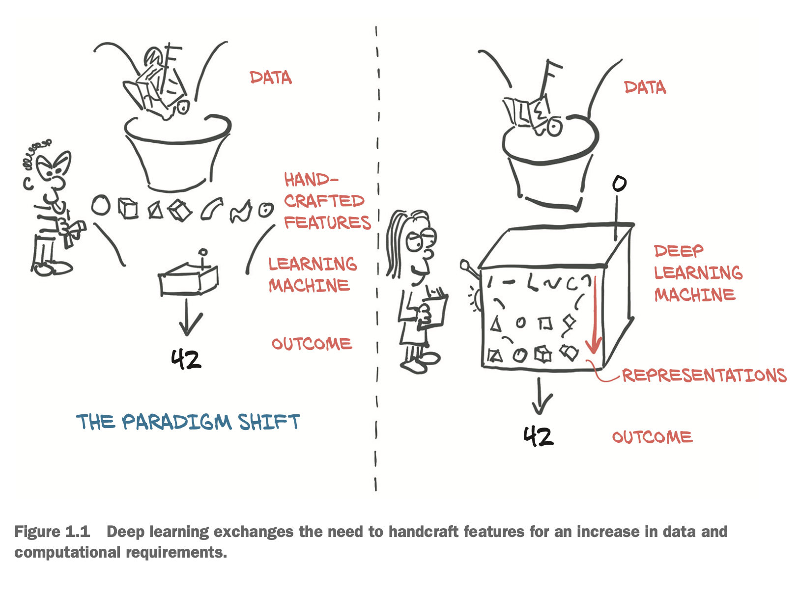
#. 1.2 - Pytorch for deep learning
#. 1.3 - Why PyTorch?
    a) Pythonic, ubiquitous, allows GPU use
    #) Flexible, allows complex implementation of ideas w/o unneccessary complexity
       from the library.
#. 1.3.1 - The Deep Learning Competitive landscape
    a) Before pytorch's first release
        #. Theono / TensorFlow (TF) were the premiere low-level libs with user
           defined computational graph
        #. Lasagne / Keras were high-level wrappers around Theono, TF and CNTK as well
        #. Caffe, CHainer, DyNet, Torch all had their own niches
    #) W/in 2 years, the community consolidated behind PyTorch or TF
        #. Theono ceased active dev
        #. TF
            * consumed Keras
            * Added Pytorch-like "eager mode"
        #. JAX, by google, became the Numpy-like equivalent for FPUs
        #. Pytorch
            * Consumed Caffe2 for backend
            * Replaced most low-level code reused from Lua-based Torch project
            * Added support for ONNX, vendor-neutral model description and exchange
              format
            * Added delayed-execution 'graph mode' runtime called TorchScript
            * Replaced CNTK and Chainer as framework of choice for respective
              corporate sponsors
    #) TF is more industry-wide community, PyTorch used by academia / teaching
#. 1.4 - Overview of how PyTorch supports deep learning projects
    a) 2 Core features
        #. Provides Tensor data structure
        #. Provides ability of tracking operations done on Tensors and track their 
           derivatives
            * 'autograd' engine under the hoold
    #) torch.nn
        #. Core of pytorch, provides
            * NN layers, fully connected layers, convolutional layers,
              activation functions and loss functions
        #. Still Needs -
            * training 
            * optimizer
    #) 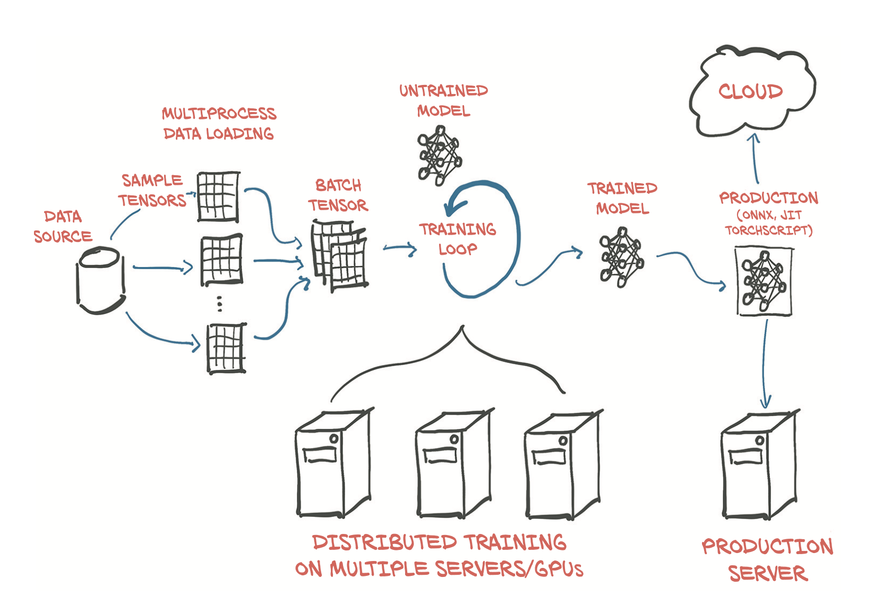 : Basic, high-level structure of a pytorch project...
        #. From left to right...
        #. Dataset (torch.utils.data)
            * Bridge from Data Source -> Tensor
            * Can parallelize and assemble data into batches
        #. Training model
            * Inputs untrained model and batch tensors
            * Outputs trained model
            * Evaluates based off of loss function (provided in torch.nn)
            * optimizer (torch.optim) to change model weights after calculating
              loss function
            * Can use torch.nn.parallel.DistributedDataParallel and torch.distributed
        #. Trained model deployed in production
#. 1.5 - Hardware and software requirements
    a) MacOS binaries don't include anything CUDA enabled b/c macs don't have CUDA
       enabled GPUs


Chapter 2 : Pre-trained Methods
=============================================
1. Intro
#. 2.1 A pretrained network that recognizes the subject of an image
    a) Working with ImageNet and Wordnet
        #. http://imagenet.stanford.edu
        #. http://wordnet.princeton.edu
    #) ImageNet Large Scale Visual Recognition Challeng
        #. Competition started in 2010
        #. 1.2million images
    #) Each file is an RGB image w/ h x w and 3 color channels
    #) Output is a 1000 element tensor corresponding with the 1000 possible class 
       values
        #. See 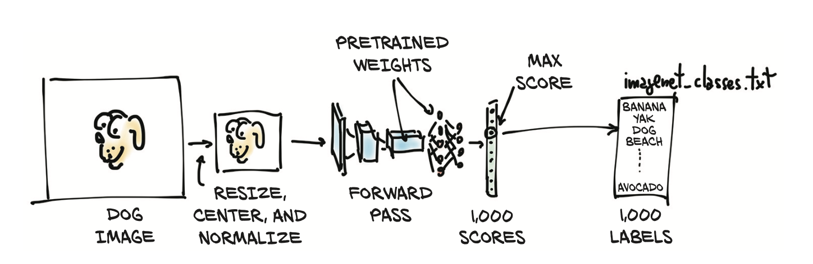 
#. 2.1.1 Obtaining a pretrained network for image recognition
    a) Download model
        #. [TOrch Vision](https://github.com/pytorch/vision)
        #. [AlexNet](http://mng.bz/lo6z)
        #. [ResNet](https://arxiv.org/pdf/1512.03385.pdf)
        #. [Inception 3](https://arxiv.org/pdf/1512.00567.pdf)
    #) AlexNet
        #. Won ILSVRC in 2012 w/ an error rate of 15.4%, 2nd place was 26.2%
    #) Fig 2.3 : The AlexNet architecture
        #. 
#. 2.1.2 AlexNet
    #) Won ILSVRC in 2012 w/ an error rate of 15.4%, 2nd place was 26.2%
    #) Fig 2.3 : The AlexNet architecture
        #. 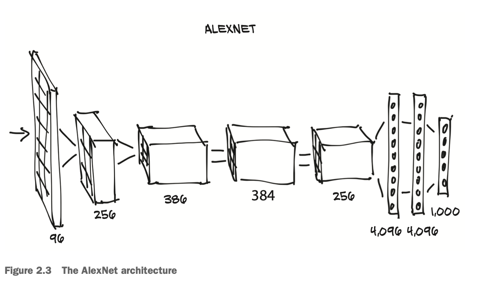
        #. Think of it as a 'filter', takes images in and transforms them to out
           images
    #) Initialize
        ```
        alexnet = models.AlexNet()
        # Run forward pass, assuming right type and dim
        output = alexnet(input)
        ```
    #) As is, the weights aren't useful b/c untrained.
        #. Need to train or load previous trained model
    #) `models` module
        #. Uppercase names correspond to classes that implement popular architectures
        #. Lowercase names are functions to instantiate models w/ predefined numbers
           of layers and units.

#. 2.1.3 ResNet
    a) Resnet is a 101 layers convolutional NN.
    #) Used trick, previously thought you couldn't get good accuracy with that many
       layers
    #) Instantiate
        ```
        from torchvision import models
        resnet = models.resnet101(pretrained=True)
        ```
    #) 44.5 million params

#. 2.1.4 Ready, set, almost  run
    a) Print out resnet
        ```
        resnet
        ```
    #) Outputs modules, a.k.a. 'layers'
    #) torchvision comes with preprocessing tools to resize and rescale colors
        ```
        from torchvision import transforms
        preprocess = transforms.Compose([
        transforms.Resize(256),
        transforms.CenterCrop(224),
        transforms.ToTensor(),
        transforms.Normalize(
        mean=[0.485, 0.456, 0.406],
        std=[0.229, 0.224, 0.225]
        )])
        ```
    #) Test with an image
        ```
        from PIL import Image
        # Can't read Apple's HEIC format
        # Doesn't handle pngs well (maybe 4 color channels?). Converted from png to jpg and
        # works
        img = Image.open("/Users/asnedden/Downloads/two_people_on_tractor.png")
        img.show() # illustrates image
        # preprocess from function above
        img_t = preprocess(img)     # returns tensor
        
        # RUN!
        import torch
        batch_t = torch.unsqueeze(img_t, 0)
        
        # necessary initialization step 
        resnet.eval()
        
        batch_t = torch.unsqueeze(img_t, 0)
        out = resnet(batch_t)
        ```
#. 2.1.5 Run!
    a) Find best match
        ```
        out.shape # this is 1col x 1000rows
        # Extract labels, downloaded from github
        with open('data/p1ch2/imagenet_classes.txt') as f:
           labels = [line.strip() for line in f.readlines()]
        # Get the label with max value from out
        _, index = torch.max(out, 1)
        percentage = torch.nn.functional.softmax(out, dim=1)[0] * 100
        labels[index]   # 'tractor'
        labels[index[0]], percentage[index[0]].item()
        # WIN
        ```
    #) Get the next best matches
        ```
        _, indices = torch.sort(out, descending=True)
        [(labels[idx], percentage[idx].item()) for idx in indices[0][:5]]
        # Returns all farm related equipment
#. 2.2 - A pretrained model that fakes it until it makes 
    a) Say we want to pass art forgeries
        #. We don't know how to paint
        #. Need feedback from artists, but how to if we took to to an auction house
           we'd get kicked out w/o any feedback
        #. Enter GAN game
#. 2.2.1 - The GAN game
    a) E.g. one NN is the 'fake painter' otehr is the 'art historian'
    #) Jargon
        #. GAN = Generative Adversarial Network
            * Generative  = something is being created, i.e. fake masterpieces
            * Adversarial = two networks competing to outsmart each other
            * Network     = duh
        #. generator = AI painter
        #. discriminator = amoral art inspector
    #) 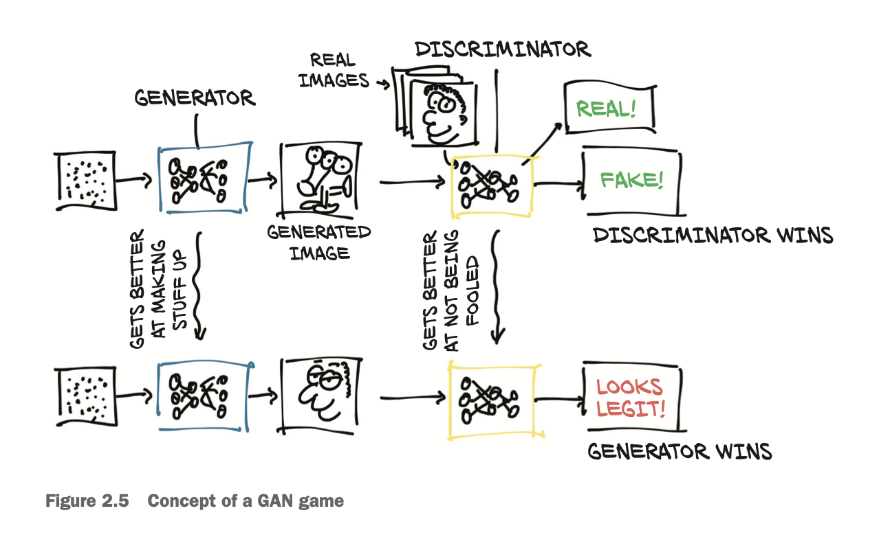
        #. It is an iterative process where the discriminator's feedback is used
           to adjust the generator's generated images
        #. Note who 'wins' isn't relevant, it is just how they are training 
        #. Not often used, but can generate amazing results, when it works.
#. 2.2.2 - CycleGAN
    a) Process of turning images from one domain to another 
    #) 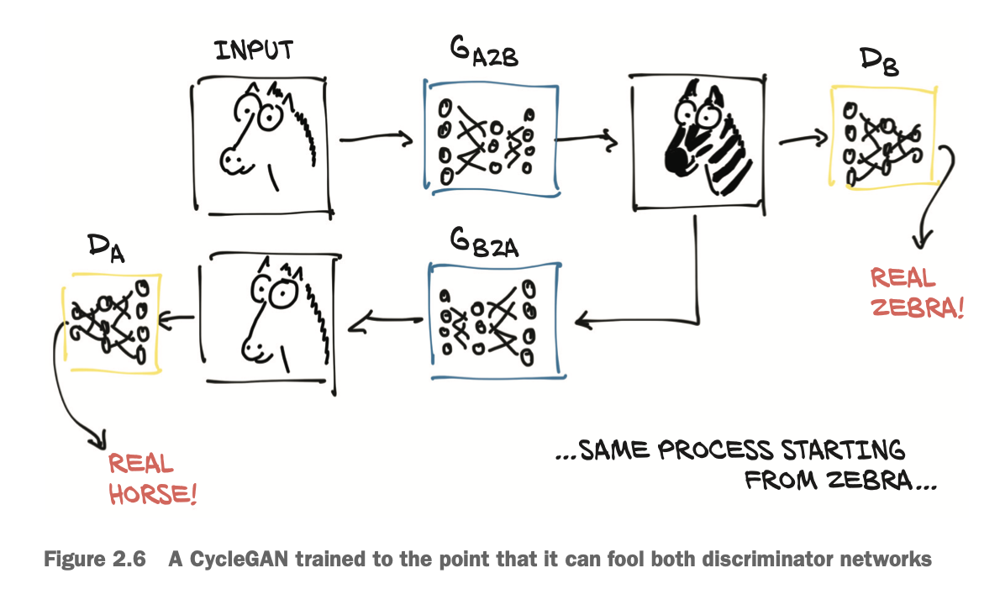
        #. Two generators, two discriminators
    #) QUESTION : I don't fully understand how this works
#. 2.2.3 - A network that turns horses into zebras
    a) CycleGAN trained on horse and zebra images extracted from ImageNet dataset
    #) Try yourself
        ```
        from three_cyclegan import ResNetGenerator
        model_path = 'data/p1ch2/horse2zebra_0.4.0.pth'
        model_data = torch.load(model_path)
        netG.load_state_dict(model_data)
        netG = ResNetGenerator()
        # Put it evaluation mode
        netG.eval()     # Takes horse image, turns into zebra
        # This takes 
        from PIL import Image
        from torchvision import transforms
        # This makes sure the input to netG is correct format
        preprocess = transforms.Compose([transforms.Resize(256),
                                        transforms.ToTensor()])
        img = Image.open("/Users/asnedden/Downloads/two_people_on_tractor.jpg")
        img_t = preprocess(img)
        batch_t = torch.unsqueeze(img_t, 0)

        # Evaluate
        batch_out = netG(batch_t)

        # Convert back to image
        out_t = (batch_out.data.squeeze() + 1.0) / 2.0
        out_img = transforms.ToPILImage()(out_t)
        # out_img.save('../data/p1ch2/zebra.jpg')
        out_img
        ```
#. 2.3 - A pretrained network that describes scenes
    a) 
        #. Captioning model.  Trained on model of captioned images
        #. First half finds descriptive words
        #. Second half uses recurrent method w/ multiple forward passes to make an
           intelligeable sentence.
#. 2.3.1 - NeuralTalk
    a) It could describe the created image of the rider on the zebra (from 2.2.3)
       with spurious zebra stripes
        #. It would label as 
#. 2.4 - Torch Hub
    a) Can publish model on Github w/ or w/o pretrained weights and exposed through
       interface PyTorch understands
        #. Need `hubconf.py` : 
            ```   
            dependencies = ['torch', 'math']
            def some_entry_fn(*args, **kwargs):
                model = build_some_model(*args, **kwargs)
                return model

            def another_entry_fn(*args, **kwargs):
                model = build_another_model(*args, **kwargs)
                return model
            ```   
#. 2.5 - Conclusion
    a) It was fun!


Chapter 3 : It starts with a tensor
=============================================
#. 3.1 - The world as floating-point numbers
    a) Must encode real-world data into floats
        #. 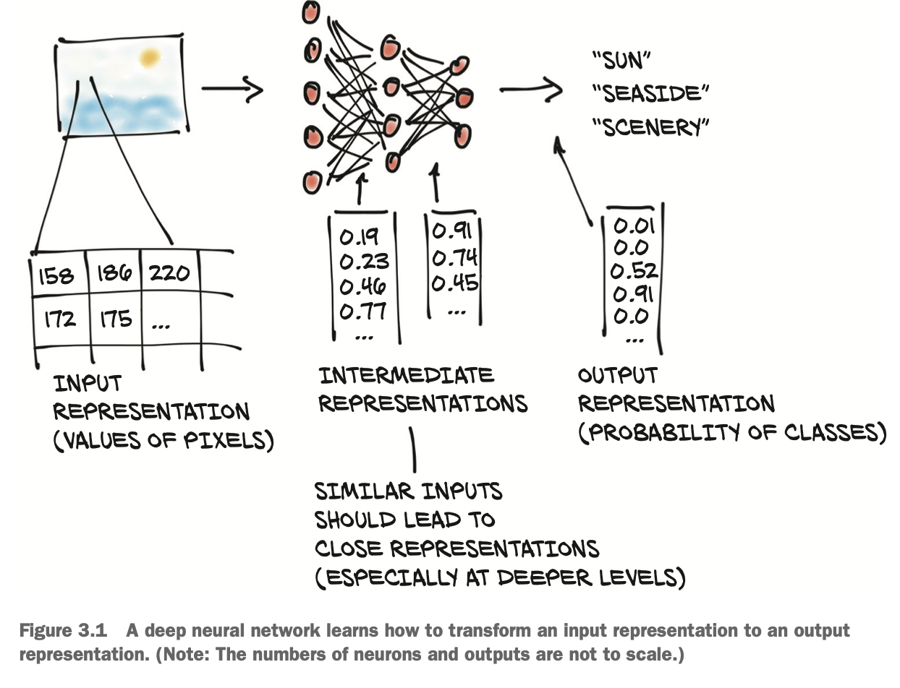 
    #) Need solid understanding of how pytorch handles and stores data
    #) Tensor
        #. Not the traditional mathematical form of 'tensor' with notion of spaces
           reference systems and transformations.
            * Do not apply here
        #. Just an 'N' dimensional vector
    #) 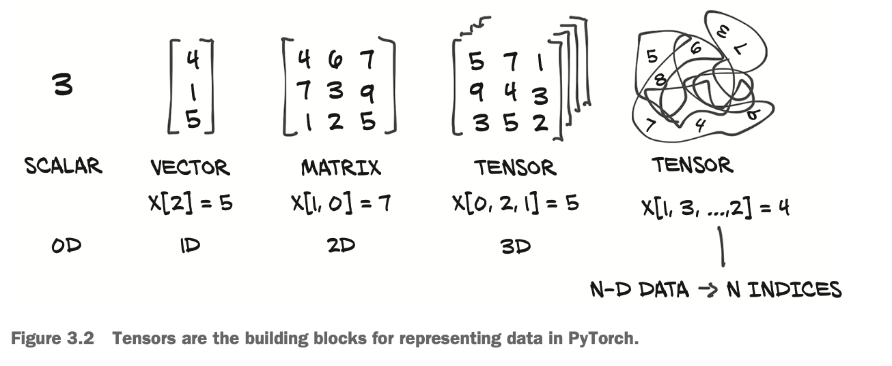 
    #) Numpy is a competitor to pytorch in the multi-dimensional vector business
#. 3.2 - Tensors: Multidimensional arrays
#. 3.2.2 - Constructing our first tensors
    ```
    import torch
    tensor([1., 1., 1., 1.])
    ```
#. 3.2.3 - The essence of tensors
    a)  
        #. Python list, scattered in RAM
        #. Tensor / Array = contiguous memory
    #) Can convert Python list to a tensor, a la
        ```
        points = torch.tensor([4.0, 1.0, 5.0, 3.0, 2.0, 1.0])
        points.shape
        ```
#. 3.3 - Indexing tensors
    a) Similar syntax as numpy
#. 3.4 - Named tensors
    #) Basically like pandas column names, illustrated by the incredible 
       diverstiy displayed by how BW images are handled, e.g.
        ```
        img_t = torch.randn(3, 5, 5) # shape [channels, rows, columns]
        weights = torch.tensor([0.2126, 0.7152, 0.0722])
        # Now name
        weights_named = torch.tensor([0.2126, 0.7152, 0.0722], names=['channels'])
        img_named = img_t.refine_names(..., 'channels', 'rows', 'columns')

        >>> img_named.shape, img_named.names
        (torch.Size([3, 5, 5]), ('channels', 'rows', 'columns'))
        >>> weights_named.shape, weights_named.names
        (torch.Size([3]), ('channels',))

        # weights_named and img_named are mis-aligned, lets fix it via :
        >>> weights_aligned = weights_named.align_as(img_named)
        >>> weights_aligned
        tensor([[[0.2126]],
        
                [[0.7152]],
        
                [[0.0722]]], names=('channels', 'rows', 'columns'))
        >>> weights_aligned.shape
        torch.Size([3, 1, 1])
        ```
    #) Pytorch uses [Einstein notation](https://rockt.ai/2018/04/30/einsum)
        #. Reading that page
            * QUESTION : Why does first eqn use $c_{j}$ instead of $\textbf{C_{ij}}$? 
        #. Follows typical index-contraction we remember from physics
        #. Implemented via : 
            ```
            numpy.einsum(equation, operands)
            torch.einsum(equation, operands)
            tf.einsum(equation, operands)
            ```
        #. Example : First equation 
            * Latex version 
                $$
                c_{j} \sum_{i} \sum_{k} A_{ik} B_{kj}
                $$
            * torch version
                ```
                c_j = torch.einsum("ik,kj->j", [A, B])
                ```
        #. Tangible example of taking a transpose
            ```
            >>> A = torch.randn(2,3)
            >>> A
            tensor([[-0.8336, -1.3203, -0.5381],
                    [ 0.1549, -0.6943, -0.7840]])
            >>> torch.einsum("ij->ji", A)
            tensor([[-0.8336,  0.1549],
                    [-1.3203, -0.6943],
                    [-0.5381, -0.7840]])
            ```
        #. Tangible example of index contraction
            ```
            >>> A = torch.tensor([[1,2],[3,4]])
            >>> A
            tensor([[1, 2],
                    [3, 4]])
            >>> B = torch.tensor([[1,2],[3,4],[5,6]])
            >>> B
            tensor([[1, 2],
                    [3, 4],
                    [5, 6]])
            >>> torch.einsum("ij,kj->ik",[A,B])
            tensor([[ 5, 11, 17],
                    [11, 25, 39]])
            ```
    #) Pytorch uses [Einstein notation](https://rockt.ai/2018/04/30/einsum)
    #) Given that this is experimental, why are you wasting my time?
#. 3.5 - Tensor element types
    a) What to store in Tensor?
        #. Numeric types are objects, fine for small things, bad in bulk.
        #. List in python are meant for sequential collections of objects. Bad
           in terms of memory organization
        #. Python interpreter is slow compared to compiled code
        #. Tensor must have the same type and are low level C value types.
#. 3.5.1 - Specifying the numeric type with dtype
    a) Similar to numpy
#. 3.5.2 - A dtype for every occasion
#. 3.5.3 - Managing a tensor's dtype attribute
    a) Get `dtype` via `tensor.dtype`
    #) Can cast to new dtype a la `tensor.to(dtype=torch.double)`
#. 3.6 - Tensor API
    a) Offers operations similar to numpy, no surprise
#. 3.7 - Tensors : Scenic views of storage
    a) Low level object is torch.Storage
        #. 1D object
#. 3.7.1 - Indexing into storage
#. 3.7.2 - Modifying store values : In-place operations
    a) Why are they bothering us with all this low-level detail?
    #) Trailing underscore means that operation is done in place
        ```
        a = torch.ones(3, 2)
        a.zero)+_()
        ```
#. 3.8 - Tensor metadata : Size, offset, and stride
    a) Basically, this is the info you'd need to store multidimensional matrices
       in memory
        #. size = number of elements
        #. stride = how to skip to next 'row' in matrix.
        #. offset = i.e. index to beginning of data (almost like a pointer)
        #. See : 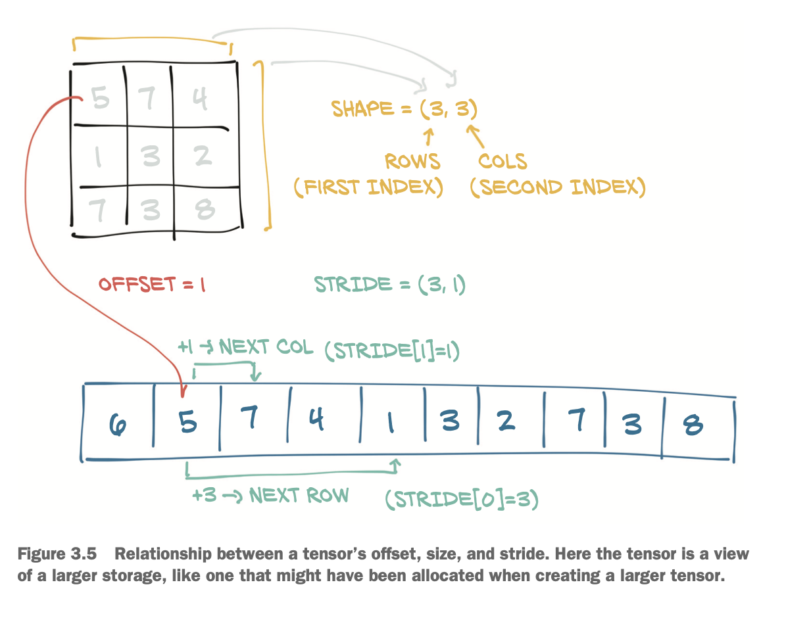 
#. 3.8.1 - Views of another tensor’s storage
    a) Taking transpose is just changing stride and such, no reallocation of mem
#. 3.8.2 - 
    #) See : 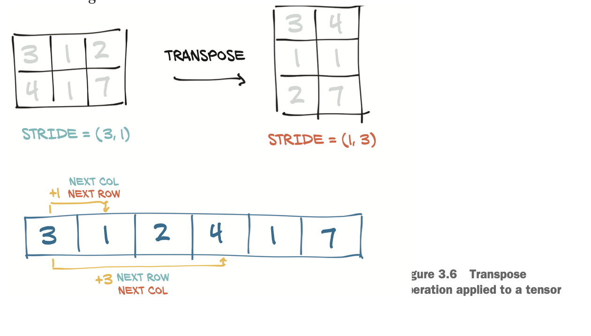 
#. 3.8.3 - Transposing in higher dimensions
#. 3.8.4 - Contiguous tensors
        ```
        >>> points = torch.tensor([[4.0, 1.0], [5.0, 3.0], [2.0, 1.0]])
        >>> points_t = points.t()
        >>> points_t
        tensor([[4., 5., 2.],
                [1., 3., 1.]])
        >>> points_t.storage()
        4.0
        1.0
        5.0
        3.0
        2.0
        1.0
        >>> points_t.stride()
        (1, 2)
        >>> points_t_cont = points_t.contiguous()
        >>> points_t_cont
        tensor([[4., 5., 2.],
                [1., 3., 1.]])
        >>> points_t_cont.stride()
        (3, 1)
        >>> points_t_cont.storage()
        # Out[46]:
        4.0
        5.0
        2.0
        1.0
        3.0
        1.0
        [torch.FloatStorage of size 6]
        ```
    #) Notice that the memory has been shuffled
    #) See : 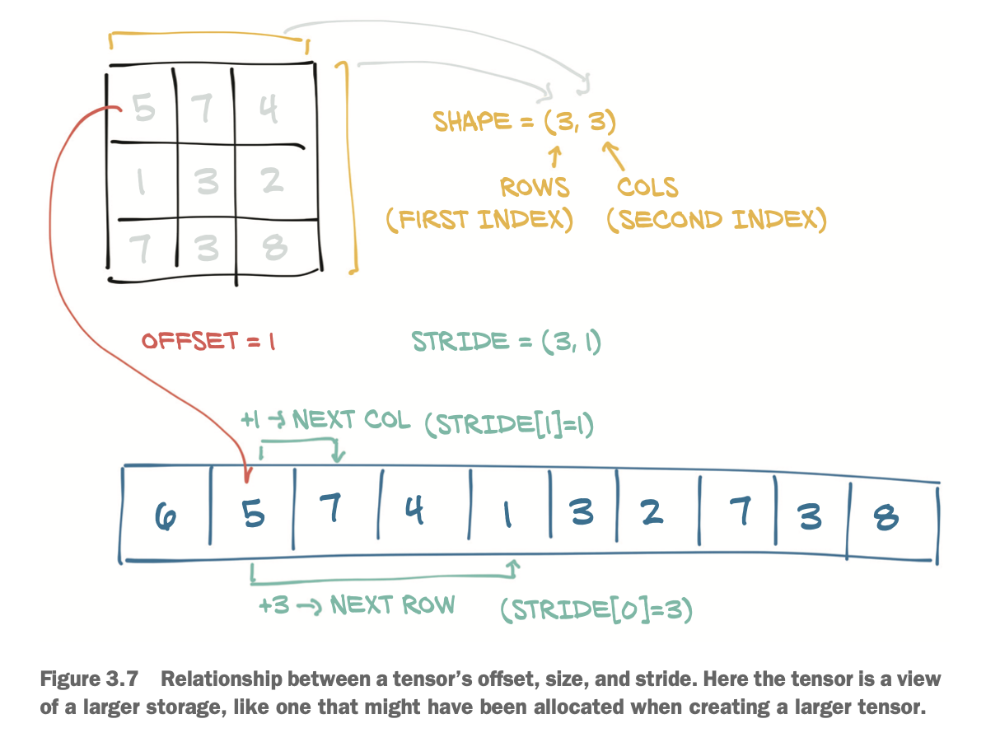 
#. 3.9 - Moving tensors to the GPU
    a) e.g. 
        ```
        # 
        points_gpu = points.to(device='cuda')
        # Specify a specific GPU
        points_gpu = points.to(device='cuda:0')
        # Have to move data back to cpu
        points_cpu = points_gpu.to(device='cpu')
        ```
#. 3.10 - Numpy interoperability
    a) e.g.
        ```
        points = torch.from_numpy(points_np)
        ```
    #) Note pytorch prefers 32bit floating point numbers, while numpy is 64bit.
        #. Handle accordingly
    #) pytorch and numpy have same underlying data structure, so conversion costs
       nothing
#. 3.11 - Generalized tensors are tensors, too
    a) Basically, if someone has a data structure that meets the torch tensor API
       it is a 'tensor'
        #. Many implementations
#. 3.12 - Serializing tensors
    a) Uses 'pickle' under the hood
    #) e.g.
        ```
        # Saving
        torch.save(points, 'somefile.t')
        # Loading
        points - torch.load('somefile.t')
        ```
#. 3.12.1 - Serializing to HDF5 with h5py


Chapter 4 : Real-world data representation using tensors
=============================================
1. 4.0
    a) Q : How do we represent a piece of data into a tensor?
    #) A : We'll learn here. Some manipulation will be required

#. 4.1 - Working with images
    a) Image is a collection of scalars arranged in a regular grid.
        #. Can be RGB, grey scale or other
        #. Consumer is 8bit, medical images are 12 or 16bit

#. 4.1.1 - Adding Color channels

#. 4.1.2 - Loading an image file
    a) Use imageio lib, could use torchvision instead
        ```
        >>> import imageio
        # imageio.imread is deprecated
        >>> img_arr = imageio.v3.imread("/Users/asnedden/Downloads/two_people_on_tractor.png")
        >>> img_arr.shape
        (2076, 1556, 4)
        ```

#. 4.1.3 - Changing the layout
    a) Reshaping tensor via permute
        ```
        >>> import torch
        >>> img = torch.from_numpy(img_arr)
        >>> img.shape
        torch.Size([2076, 1556, 4])
        >>> out = img.permute(2, 0, 1)
        # No copy created, just refs same underlying data
        >>> out.shape
        torch.Size([4, 2076, 1556])
        ```

    #) Load multiple images into tensor
        ```
        batch_size = 3
        # N x C x H x W
        #   --> N = number of images
        #   --> C = colors
        batch = torch.zeros(batch_size, 3, 256, 256, dtype=torch.uint8)
        ```

    #) Try w/ real data
        ```
        import os; import torch; import imageio

        data_dir = 'data/p1ch4/image-cats'
        filenames = [name for name in os.listdir(data_dir) if os.path.splitext(name)[-1] == '.png']

        for i, filename in enumerate(filenames):
            img_arr = imageio.imread(os.path.join(data_dir, filename))
            img_t = torch.from_numpy(img_arr)
            img_t = img_t.permute(2, 0, 1)
            # Keep only 3 channels. Sometimes images have a 'transparency' channel
            img_t = img_t[:3]
            batch[i] = img_t
        ```
        
#. 4.1.4 - Normalizing the data
    a) NN work better when data values range from [0,1] or [-1,1]
    #) Could just divide by 255
        ```
        batch = batch.float()
        batch /= 255.0
        ```
    #) Normalize, center and make unit std
        ```
        n_channels = batch.shape[1]
        for c in range(n_channels):
            mean = torch.mean(batch[:, c])
            std = torch.std(batch[:, c])
            batch[:, c] = (batch[:, c] - mean) / std
        ```
    #) QUESTION : should the std and mean be over the whole data set or over
                  specific images?

#. 4.2 - 3D images: Volumetric Data
    a) CT Images
        #. Gray scale, so color dimension is ignored
        #. 5D tensor : N x C x D x H x W
            * N - number of images
            * C - color, 1, grayscale
            * D - depth, i.e. z
            * H - height
            * W - width

#. 4.2.1 - Loading a specialized format
    a) Example of 5D data
        ```
        import torch
        import imageio
        
        data_dir = 'data/p1ch4/volumetric-dicom/2-LUNG 3.0  B70f-04083'
        vol_arr = imageio.volread(data_dir, 'DICOM')
        vol_arr.shape
        
        vol = torch.from_numpy(vol_arr).float()
        # Add extra dimension so torch expects it
        vol = torch.unsqueeze(vol, 0)
        ```

#. 4.3 - Representing tabular data
    a) Simplest data is either table or csv, without any inherent ordering (i.e. not
       time series

#. 4.3.1 - Using a real-world dataset
    a) See : public available data sets :
        #. https://github.com/caesar0301/awesome-public-datasets.
    #) Wine Quality 
        #. data/4.1.3_wine_quality.csv
        #. Downloaded from https://archive.ics.uci.edu/ml/machine-learning-databases/wine-quality/winequality-white.csv
        #. Variables
            * fixed acidity
            * volatile acidity
            * citric acid
            * residual sugar
            * chlorides
            * free sulfur dioxide
            * total sulfur dioxide
            * density
            * pH
            * sulphates
            * alcohol
            * quality
#. 4.3.2 - Using a real-world dataset
    ```
    import torch
    import pandas as pd
    # Convert to torch tensor
    df = pd.read_csv('data/4.1.3_wine_quality.csv', sep=';')
    wineq = torch.from_numpy(df.values)
    print(wineq.shape, wineq.dtype)
    ```
    a) Continuous, ordinal and categorical variables
        #. continuous = floats, just as you'd expect
        #. ordinal = integers, relative sizes matter (e.g. small, medium, large)
        #. categorical = integers, no relative size implied
    
#. 4.3.3 - Representing scores
    a) For wine data, keep score as continuous variable. Keep it as a real number
    #) Hold back the 'score' variable since that is what we'll be predicting
    ```
    # Drop quality, b/c that is our dependent variable we want to predict
    data=wineq[:,:-1]
    data, data.shape

    # Grab dependent variable we want to predict
    target = wineq[:, -1].long()        # 64bit int needed later by scatter()
    target, target.shape
    ```
    
#. 4.3.4 - One-hot encoding
    a) Appropriate for purely categorical variables
        #. For 10 categories, the vector might look like :
            ```
            v = (1,0,0,...,0)
            ```
        #. Only one value is non-zero.
        #. No implied distance or ordering
    #) Use scatter_() to create one-hot encoding
        ```
        target.max()        # tensor(9)
        target.min()        # tensor(3)

        # 10 possible values for dependent variable we want to predict
        target_onehot = torch.zeros(target.shape[0], 10)
        
        # Modified in place
        # Positionally populate with '1' for each int value in target
        #   --> Really wants 64bit ints
        #   --> Just maps int, to INDEX in array, so '6' get mapped to index 6
        target_onehot.scatter_(1, target.unsqueeze(1), 1.0)
        ```
    #) Note '_' in scatter_() denotes modifying in place
    #) Note that the first 4 columns (0 indexed) will not
    #) unsqueeze adds 'extra' dummy dimension b/c target_onehot has two dims


#. 4.3.5 - When to categorize
    a) 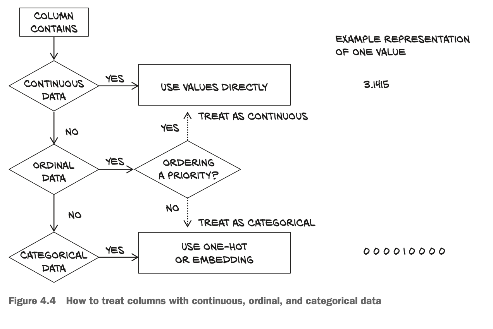
        #. Gives relevant logic.
    #) Find mean and stdev
        ```
        # Mean over 11 chemical categories
        >> data_mean = torch.mean(data, dim=0)
        >> data_mean 
        tensor([23.3296, 15.3521, 14.3205,  ..., 14.8194, 14.0655, 13.0709], 
               dtype=torch.float64)

        >>> data_var = torch.var(data, dim=0)
        >>> data_var
        tensor([7.1211e-01, 1.0160e-02, 1.4646e-02, 2.5726e+01, 4.7733e-04, 2.8924e+02,
                1.8061e+03, 8.9455e-06, 2.2801e-02, 1.3025e-02, 1.5144e+00],
               dtype=torch.float64)
        ```
    #) Normalize data 
        #. Center by subtracting mean
        #. Normalize by dividing by stdev
        ```
        # 1/sqrt(N) is (non-intuitively) accomadated by torch.var()
        data_normalized = (data - data_mean) / torch.sqrt(data_var)
        ```
        #. QUESTION : How does it know to do it along the correct dimension?
#. 4.3.6 - Finding thresholds
    a) Look at really bad wines...recall target is 'rating'
        ```
        bad_indexes = target <= 3       # no wines are lower than 3..
        bad_indexes.shape, bad_indexes.dtype, bad_indexes.sum()
        # Can slice a la pandas
        bad_data = data[bad_indexes]
        bad_data.shape
        ```
    #) Look at mean of features for bad, mid and good wines
        ```
        mid_data = data[(target > 3) & (target < 7)]    # I don't think pandas can do that
        good_data = data[target >= 7]

        # Get means
        bad_mean = torch.mean(bad_data, dim=0)
        mid_mean = torch.mean(mid_data, dim=0)
        good_mean = torch.mean(good_data, dim=0)

        # Look at df.columns, see obvious pattern in 'chlorides', 'free_sulfur_dioxide'
        # adn 'total_sulfur_dioxide' both decrease as bad -> good
        for i, args in enumerate(zip(df.columns, bad_mean, mid_mean, good_mean)):
                print('{:2} {:20} {:6.2f} {:6.2f} {:6.2f}'.format(i, *args))

         0 fixed_acidity          7.60   6.89   6.73
         1 volatile_acidity       0.33   0.28   0.27
         2 citric_acid            0.34   0.34   0.33
         3 residual_sugar         6.39   6.71   5.26
         4 chlorides              0.05   0.05   0.04
         5 free_sulfur_dioxide   53.33  35.42  34.55
         6 total_sulfur_dioxide 170.60 141.83 125.25
         7 density                0.99   0.99   0.99
         8 pH                     3.19   3.18   3.22
         9 sulphates              0.47   0.49   0.50
        10 alcohol               10.35  10.26  11.42
        ```
    #) Let's threshold on totla_sulfur_threshold
        ```
        total_sulfur_threshold = 141.83
        # slice
        total_sulfur_data = data[:,6]
        predicted_indexes = torch.lt(total_sulfur_data, total_sulfur_threshold)
        # boolean tensor, type, number of wines above threshold
        # --> 2727 total wines
        predicted_indexes.shape, predicted_indexes.dtype, predicted_indexes.sum()

        # Instead of cutting on total_sulfur, cut on target
        # --> 3258 total wines
        actual_indexes = target > 5
        actual_indexes.shape, actual_indexes.dtype, actual_indexes.sum()
        ```
    #) More (3258) actually good wines (i.e. target > 5) than our threshold predicts
       (2727)
    #) Look at intersection
        ```
        # item() gets the value rather than a tensor
        n_matches = torch.sum(actual_indexes & predicted_indexes).item()    # = 2018
        n_predicted = torch.sum(predicted_indexes).item()                   # = 2727
        n_actual = torch.sum(actual_indexes).item()                         # = 3258

        # Fraction of predicted matches are correct
        print(n_matches, n_matches / n_predicted)

        # Fraction of good wines properly identified
        print(n_matches, n_matches / n_actual)
        ```
#. 4.4 - Working with time series
    a) Get Bike Time sharing series
        #. https://archive.ics.uci.edu/dataset/275/bike+sharing+dataset
    #) 
        #. Goal is to convert flat 2D and transform it to 3D
        #. 3rd dimension is time..
#. 4.4.1 - Adding a time dimension
    a) Load the data, let's use pandas instead of np.loadtxt()...
        ```
        import pandas as pd
        import torch

        # Convert column dteday to day of the month..
        df = pd.read_csv("data/p1ch4/bike-sharing-dataset/hour-fixed.csv", converters={1: lambda x: float(x[8:10])})

        bikes = torch.from_numpy(df.values)
        ```
    #) Jargon
        #. 'N' = parallel sequences of size 'C'
        #. 'C' = 'channel'
#. 4.4.2 - Shaping the data by time period
    a) Data dimeension : 
        #. $N \times C \times L$ where
            * $N$ = number of samples
            * $C$ = number of channels (i.e. columns / variables)
            * $L$ = length, in this case 24 (h)
        ```
        print(bikes.shape, bikes.stride())
        # Reshapes Tensor - 
        #   --> last two args, say the shape we want the other two to be
        #   --> The '-1' means to calculate the last thing based off args[1,2]
        daily_bikes = bikes.view(-1, 24, bikes.shape[1])
        print(daily_bikes.shape, daily_bikes.stride())
        # (torch.Size([730, 24, 17]), (24, 1, 17520))

        daily_bikes = daily_bikes.transpose(1, 2)
        print(daily_bikes.shape,daily_bikes.stride())
        # (torch.Size([730, 17, 24]), (24, 17520, 1))
        ```
        #. QUESTION : I think his bikes.stride() is WRONG?  Since it is related to
                      storage in memory, there is a chance that it is platform 
                      dependent
#. 4.4.3 - Ready for training
    a) Let's do the one-hot encoding method
        ```
        first_day = bikes[:24,:].long()
        weather_onehot = torch.zeros(first_day.shape[0], 4)

        # 9th column is orginal weather data
        first_day[:,9]
    
        # Now use one-hot encoding, recall this is really ordinal data.., one hot
        # encoding is best used for categorical data

        # -1 b/c onehot coding is 0 indexed..
        # --> modifies in place
        weather_onehot.scatter_(dim=1,
                                index=first_day[:,9].unsqueeze(1).long() -1,
                                value=1.0)

        # Append / cat onehot as columns to bikes
        torch.cat((bikes[:24], weather_onehot), 1).shape

        # Can do same w/ reshaped daily_bikes, recall shape = [730, 17, 24]
        # --> Note here that we are making it the same dimension as the number
        #     of days which is different from above where we only handled one day
        daily_weather_onehot = torch.zeros(daily_bikes.shape[0], 4, 
                                           daily_bikes.shape[2])
        daily_weather_onehot.shape
        # torch.Size([730, 4, 24])

        # Now expand one-hot encoding
        daily_weather_onehot.scatter_(1, daily_bikes[:,9,:].long().unsqueeze(1) - 1, 1.0)

        # Now concatenate along C dimension, where shape = (B, C, L)
        daily_bikes = torch.cat((daily_bikes, daily_weather_onehot), dim=1) 
        daily_bikes.shape
        # torch.Size([730, 21, 24])

        # Instead of just treating like a categorical variable. 
        # --> Normalize column 9
        daily_bikes[:, 9, :] = (daily_bikes[:, 9, :] - 1.0) / 3.0
        daily_bikes[:,9,:].unique()
        # tensor([0.0000, 0.3333, 0.6667, 1.0000], dtype=torch.float64)

        # df.columns[10] == temp(erature)
        temp = daily_bikes[:, 10, :]
        temp_min = torch.min(temp)
        temp_max = torch.max(temp)
        daily_bikes[:, 10, :] = ((daily_bikes[:, 10, :] - temp_min) /
                                 (temp_max - temp_min))
        ## Alternatively, get unitary stdev
        daily_bikes[:, 10, :] = ((daily_bikes[:, 10, :] - torch.mean(temp)) /
                                  torch.std(temp))
        ```

#. 4.5 - Representing text
    a) Recurrent Neural Networks (RNN)
        #. Successful with text categorization, text generation and automated   
           translation systems
    #) Transformers, more flexible to incorporate past information has made a big 
       splash
        #. Previously, NLP workloads had sophisticated multistage pipelines that 
           included rules encoding grammar.
        #. Now you just use the corpora directly, let rules emerge
#. 4.5.1 - Converting text to numbers
    a) Use gutenberg project (www.gutenberg.org) or Wikipedia articles
    #) Load Jane Austen's Pride and Prejudice from Gutenber website
        ```
        with open('data/p1ch4/jane-austen/1342-0.txt', encoding='utf8') as f:
            text = f.read()
        ```
#. 4.5.2 - One-hot-encoding characters
    a) ASCII = 8 bits for English language
        #. Unicode = UTF-8, UTF-16, UTF-32
    #) Limit One-hot encoding to ASCII
    #) Split text into lines, pick one to look at
        ```
        lines = text.split('\n')
        line=lines[200]

        # One hot encoding 
        letter_t = torch.zeros(len(line), 128)
        letter_t.shape
        # torch.Size([70, 128])

        for i, letter in enumerate(line.lower().strip()):
            # ord maps letter to ASCII position (?)
            letter_index = ord(letter) if ord(letter) < 128 else 0
            letter_t[i][letter_index] = 1
        ```

#. 4.5.3 - One-hot-encoding characters
    #) Now let's one-hot encode the words rather then letters
        ```
        # Strip punctuation, lowercase
        def clean_words(input_str):
            punctuation = '.,;:"!?”“_-'
            word_list = input_str.lower().replace('\n',' ').split()
            word_list = [word.strip(punctuation) for word in word_list]
            return word_list

        words_in_line = clean_words(line)
        words_in_line
        # ['impossible', 'mr', 'bennet', 'impossible', 'when', 'i', 'am', 'not', 'acquainted', 'with', 'him']

        # Now find all unique words on corpus
        word_list = sorted(set(clean_words(text)))

        # Map a word to an index in word_list
        word2index_dict = {word: i for (i, word) in enumerate(word_list)}

        len(word2index_dict), word2index_dict['impossible']
        # (7261, 3394)

        word_t = torch.zeros(len(words_in_line), len(word2index_dict))
        # torch.Size([11, 7261]), 11 words, 7261 options

        for i, word in enumerate(words_in_line):
            word_index = word2index_dict[word]
            word_t[i][word_index] = 1
            print('{:2} {:4} {}'.format(i, word_index, word))
            #  0 3394 impossible
            #  1 4305 mr
            #  2  813 bennet
            #  3 3394 impossible
            #  4 7078 when
            #  5 3315 i
            #  6  415 am
            #  7 4436 not
            #  8  239 acquainted
            #  9 7148 with
            # 10 3215 him
        ```
    #) Trade off between character vs. word level encoding. 
        #. Many fewer chars than words, not much meaning but short and concise
        #. Words have actual meaning, but gets large and bloated
    #) Compromise is to use `byte pair encoding`, use pairs of latters until reaches
       prescribed dictionary size
    #) 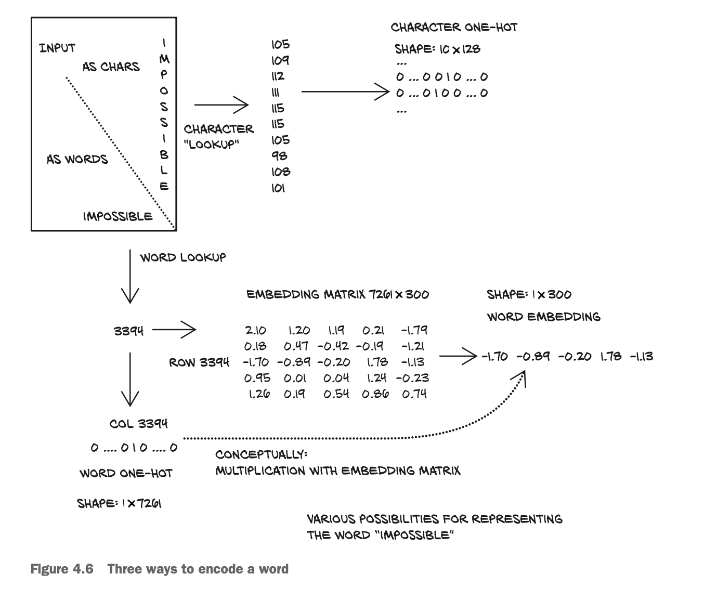

#. 4.5.4 - Text embeddings
    a) One-hot encoding 


Chapter 5 : The mechanics of learning
=============================================
The mechanics of learning 103
1. A timeless lesson in modeling 104
#. Learning is just parameter estimation 106
A hot problem 107 Gathering some data 107 Visualizing
the data 108 Choosing a linear model as a first try 108
#. Less loss is what we want 109
#. Down along the gradient 113
Decreasing loss 113 Getting analytical 114 Iterating to fit
the model 116 Normalizing inputs 119 Visualizing
(again) 122
#. PyTorch’s autograd: Backpropagating all things 123
Computing the gradient automatically 123 Optimizers a la


Chapter 6 : Using a nerual network to fit the data 
=============================================
1. Artificial neurons 142
Composing a multilayer network 144 Understanding the error
function 144 All we need is activation 145 More activation
functions 147 Choosing the best activation function 148
What learning means for a neural network 149
#. The PyTorch nn module 151
Using __call__ rather than forward 152 Returning to the linear
model 153
#. Finally a neural network 158
Replacing the linear model 158 Inspecting the parameters 159


Chapter 7 : Telling birds from airplanes : Learning from images
=============================================
1. A dataset of tiny images 165
Downloading CIFAR-10 166 The Dataset class 166
Dataset transforms 168 Normalizing data 170
#. Distinguishing birds from airplanes 172
Building the dataset 173 A fully connected model 174
Output of a classifier 175 Representing the output as
probabilities 176 A loss for classifying 180 Training the


Chapter 8 : Using convolutions to generalize
=============================================
1. The case for convolutions 194
What convolutions do 194
#. Convolutions in action 196
Padding the boundary 198 Detecting features with
convolutions 200 Looking further with depth and pooling 202
Putting it all together for our network 205
#. Subclassing nn.Module 207
Our network as an nn.Module 208 How PyTorch keeps track of
parameters and submodules 209 The functional API 210
#. Training our convnet 212
Measuring accuracy 214 Saving and loading our model 214
Training on the GPU 215
#. Model design 217
Adding memory capacity: Width 218 Helping our model to
converge and generalize: Regularization 219 Going deeper to
learn more complex structures: Depth 223 Comparing the designs


Chapter 9 : Using PyTorch to fight cancer
=============================================
1. Introduction to the use case 236
#. Preparing for a large-scale project 237
#. What is a CT scan, exactly? 238
#. The project: An end-to-end detector for lung cancer Why can’t we just throw data at a neural network until it
works? 245 What is a nodule? 249 Our data source:
The LUNA Grand Challenge 251 Downloading the LUNA


Chapter 10 : Combining data sources into a unified dataset
=============================================
1. Raw CT data files 256
#. Parsing LUNA’s annotation data 256
Training and validation sets 258 Unifying our annotation and
candidate data 259
#. Loading individual CT scans 262
Hounsfield Units 264
#. Locating a nodule using the patient coordinate system The patient coordinate system 265 CT scan shape and
voxel sizes 267 Converting between millimeters and voxel
addresses 268 Extracting a nodule from a CT scan 270
#. A straightforward dataset implementation 271
Caching candidate arrays with the getCtRawCandidate
function 274 Constructing our dataset in LunaDataset
.__init__ 275 A training/validation split 275 Rendering


Chapter 11 : Training a classificaiton model to detect suspected tumors
=============================================
1. Training a classification model to detect suspected tumors 11.1 A foundational model and training loop 280
#. The main entry point for our application 282
#. Pretraining setup and initialization 284
Initializing the model and optimizer 285 Care and feeding of
data loaders 287
#. Our first-pass neural network design 289
The core convolutions 290 The full model 293
#. Training and validating the model 295
The computeBatchLoss function 297 The validation loop is
similar 299
#. Outputting performance metrics 300
The logMetrics function 301
#. Running the training script 304
Needed data for training 305 Interlude: The
enumerateWithEstimate function 306
#. Evaluating the model: Getting 99.7% correct means we’re
done, right? 308
#. Graphing training metrics with TensorBoard 309
Running TensorBoard 309 Adding TensorBoard support to the
metrics logging function 313
#. Why isn’t the model learning to detect nodules? 315


Chapter 12 : Improving training with metrics and augmentation 
=============================================
Improving training with metrics and augmentation 318
1. High-level plan for improvement 319
#. Good dogs vs. bad guys: False positives and false negatives 12.3 Graphing the positives and negatives 322
Recall is Roxie’s strength 324 Precision is Preston’s forte 326
Implementing precision and recall in logMetrics 327 Our
ultimate performance metric: The F1 score 328 How does our
model perform with our new metrics? 332
#. What does an ideal dataset look like? 334
Making the data look less like the actual and more like the “ideal” Contrasting training with a balanced LunaDataset to previous
runs 341 Recognizing the symptoms of overfitting 343
#. Revisiting the problem of overfitting 345
An overfit face-to-age prediction model 345
#. Preventing overfitting with data augmentation 346
Specific data augmentation techniques 347■ Seeing the
improvement from data augmentation 352


Chapter 13 : Using segmentation to find suspected nodules
=============================================
13 Using segmentation to find suspected nodules 357
1. Adding a second model to our project 358
#. Various types of segmentation 360
#. Semantic segmentation: Per-pixel classification 361
The U-Net architecture 364
#. Updating the model for segmentation 366
Adapting an off-the-shelf model to our project 367
#. Updating the dataset for segmentation 369
U-Net has very specific input size requirements 370 U-Net trade-
offs for 3D vs. 2D data 370 Building the ground truth
data 371 Implementing Luna2dSegmentationDataset 378
Designing our training and validation data 382 Implementing
TrainingLuna2dSegmentationDataset 383 Augmenting on the
GPU 384
#. Updating the training script for segmentation 386
Initializing our segmentation and augmentation models 387
Using the Adam optimizer 388 Dice loss 389 Getting images
into TensorBoard 392 Updating our metrics logging 396
Saving our model 397
#. Results 399


Chapter 14 : End-to-end nodule analysis and where to go next 
=============================================
1. Towards the finish line 405
#. Independence of the validation set 407
#. Bridging CT segmentation and nodule candidate
classification 408
Segmentation 410 Grouping voxels into nodule candidates 411
Did we find a nodule? Classification to reduce false positives 412
#. Quantitative validation 416
#. Predicting malignancy 417
Getting malignancy information 417 An area under the curve
baseline: Classifying by diameter 419 Reusing preexisting
weights: Fine-tuning 422 More output in TensorBoard 428
#. What we see when we diagnose 432
Training, validation, and test sets 433
#. What next? Additional sources of inspiration (and data) Preventing overfitting: Better regularization 434 Refined training
data 437 Competition results and research papers 438


Chapter 15 : Deploying to production 
=============================================
15 Deploying to production 445
1. Serving PyTorch models 446
Our model behind a Flask server 446 What we want from
deployment 448 Request batching 449
#. Exporting models 455
Interoperability beyond PyTorch with ONNX 455 PyTorch’s own
export: Tracing 456 Our server with a traced model 458
#. Interacting with the PyTorch JIT 458
What to expect from moving beyond classic Python/PyTorch 458
The dual nature of PyTorch as interface and backend 460
TorchScript 461 Scripting the gaps of traceability 464
#. LibTorch: PyTorch in C++ 465
Running JITed models from C++ 465 C++ from the start: The
C++ API 468
#. Going mobile 472
Improving efficiency: Model design and quantization 475
#. Emerging technology: Enterprise serving of PyTorch
models 476

